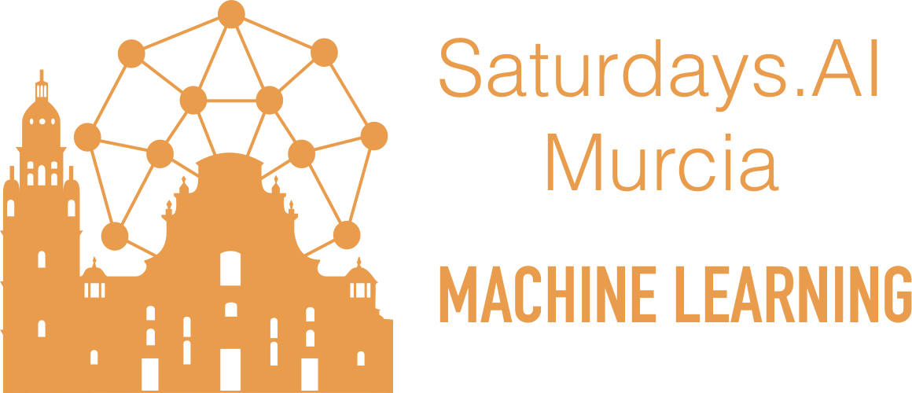

# 📒 Cuadernos

<table>
  <tr>
    <th width="50%" rowspan="3"><h3>💻<a href="/1.%20Software">1. Introducction to AI software</a></h3></th>
    <td width="30%"><a href="/1.%20Software/1.1%20Python.ipynb">🐍 Python</a></td>
    <td></td>
  </tr>
  <tr>
    <td><a href="/1.%20Software/1.2%20Pandas.ipynb">🐼 Pandas</a></td>
    <td></td>
  </tr>
  <tr>
    <td><a href="/1.%20Software/1.3%20Sklearn.ipynb">💡 Scikit-learn</a></td>
    <td></td>
  </tr>
</table>   
   
<table>
  <tr>
    <th width="50%" rowspan="5"><h3>📈<a href="/2.%20Tabular%20data%20(clas)">2. Tabular data 1 (clasification)</a></h3></th>
    <td width="30%"><a href="2.%20Tabular%20data%20(clas)/2.1%20EDA.ipynb">📊 EDA</a></td>
    <td></td>
  </tr>
  <tr>
    <td><a href="/2.%20Tabular%20data%20(clas)/2.2%20Decission%20tree.ipynb">🌳 Decission Tree</a></td>
    <td></td>
  </tr>
  <tr>
    <td><a href="/2.%20Tabular%20data%20(clas)/2.3%20Random%20Forest.ipynb">🌲 Random Forest</a></td>
    <td></td>
  </tr> 
  <tr>
    <td><a href="/2.%20Tabular%20data%20(clas)/2.4%20Gradient%20Boosting.ipynb">🌴 Gradient Boosting</a></td>
    <td></td>
  </tr>
  <tr>
    <td><a href="/2.%20Tabular%20data%20(clas)/2.5%20Neural%20Network.ipynb">🧠 Neural Network</a></td>
    <td></td>
  </tr>
</table>

> ## Next Sessions:
> 3. 📉 Tabular data 2 (regression)
>    - 🌐 Web scrapping (Beautiful soup)
>    - ✨ Clustering (K-Means, DBSCAN)
>    - 🌀 Dimensionality Reduction (PCA, t-SNE, UMAP)
> 4. 🔤 Natual Language Processing
>    - 🛠 Feature engeeering for NLP
>    - 📋 Tf-idf
>    - 💬 Word embeddings
> 5. 🕐 Time series
>    - 🛠 Feature engeeering for time
>    - 🔮 ARIMA (Facebook Prophet)
> 6. 👀 Vision
>    - 🖼 Understanding images
>    - 🔍 Convolutional Neural Network (Fastai)

# 🗓️ Agenda

| Sesión |  Día   | Tema               | Charla                           | Reto                  |
|:------:|--------|:------------------:|----------------------------------|-----------------------|
| **1**  |  1 Feb | **AI Software**    | [Pepe Palma](/diapositivas/PepePalma.pdf) y Andrés Torrubia | |  
| **2**  |  8 Feb | **Tabular data 1** | Projects brainstorming | [🍺 **Beer Challenge**](https://www.kaggle.com/c/murcia-beer-challenge) |
| **3**  | 15 Feb | **Tabular data 2** |                                  | 🚗 Car pricing        |
| **4**  | 22 Feb | **NLP**            |                                  | 🙃 Sentiment analysis |
| **5**  | 29 Feb | **Time series**    |                                  | (aun por decidir)       |
| **6**  |  7 Mar | **Vision**         |                                  | 📷 Marinera o bicicleta |
| **7**  | 14 Mar | **Project**        |                                  |                       |
| **8**  | 28 Mar | **Project**        | Biología y sanidad               |                       |
| **9**  |  4 Abr | **Project**        |                                  |                       |
| **10** | 25 Abr | **Project**        | Ética en la IA                   |                       |
| **11** |  9 May | **Project**        |                                  |                       |
| **12** | 16 May | **Project**        | Comunicación Oral                |                       |
| **13** | 23 May | **Demo Day**       | Vosotros ;)                      |                       |

## 🛠 Projects
Aqui se irán poniendo los proyectos asignados. [**Ver ideas**](/project-ideas.md)

## 📚 Best resources:
- [**Kaggle learn**](https://www.kaggle.com/learn) (⌛: Quick)
  - [Python](https://www.kaggle.com/learn/python)
  - [Pandas](https://www.kaggle.com/learn/pandas)
  - [Data visualization](https://www.kaggle.com/learn/data-visualization)
  - [Intro to machine learning](https://www.kaggle.com/learn/intro-to-machine-learning)
  - [Intermediate machine learning](https://www.kaggle.com/learn/intermediate-machine-learning)
  - [Feature engineering](https://www.kaggle.com/learn/feature-engineering)
- [**Fast.ai**](https://www.fast.ai) (⌛: Medium)
   - [Machine Learning](http://course18.fast.ai/ml)
   - [Deep learning práctico](https://course.fast.ai)
   - [Deep learning avanzado](https://course.fast.ai/part2)
   - [NLP](https://www.fast.ai/2019/07/08/fastai-nlp)
- [**Mlcourse.ai**](http://mlcourse.ai) (⌛: Long)
  - [Medium articles](https://medium.com/open-machine-learning-course)
- [**./missing-semester**](https://missing.csail.mit.edu): Curso sobre sistemas, no IA

